# NihonKana 

**NihonKana** — Android-приложение для изучения японских слоговых азбук хираганы и катаканы с помощью визуальных ассоциаций, обучающих карточек, интерактивных упражнений и отслеживания прогресса.
Приложение разработано в рамках выпускной квалификационной работы по направлению **«Прикладная информатика»**.

## О проекте

Основная идея NihonKana — облегчить запоминание японских символов за счёт сочетания графического образа символа, его транскрипции, визуальной ассоциации и аудиопроизношения.
Приложение ориентировано на начинающих изучать японский язык и работает с локальными данными без необходимости подключения к серверу.

**Примечание об иллюстрациях:**  
В учебной версии проекта для демонстрации механики визуальных ассоциаций использованы изображения из пособия «Японский с нуля» О. А. Первова. Права на исходные иллюстрации принадлежат их правообладателям.

## Возможности

- изучение хираганы и катаканы;
- обучающие карточки с символом, ромадзи, изображением-ассоциацией и текстовой подсказкой;
- воспроизведение произношения символов;
- упражнения **Kana -> Romaji**;
- упражнения **Romaji -> Kana**;
- выбор базовых и дополнительных групп символов;
- создание пользовательского набора символов для тренировки;
- автоматическая проверка ответов;
- подсчёт результатов упражнения;
- сохранение истории прохождения тренировок;
- отслеживание прогресса по отдельным символам;
- отображение прогресса по рядам хираганы и катаканы;
- определение символов, в которых пользователь чаще всего ошибается;
- справочный раздел по японской письменности;
- локальное хранение данных.

## Tech Stack

- **Kotlin**
- **Android SDK**
- **AndroidX / AppCompat**
- **XML Layouts**
- **Jetpack Compose**
- **Room Persistence Library**
- **SQLite**
- **Kotlin Coroutines**
- **SQL**
- **MediaPlayer**
- **Gradle Kotlin DSL**

## Инструменты разработки

- Android Studio
- Git
- GitHub

## Структура проекта

Функциональность приложения разделена на несколько пакетов:

- `data` — база данных Room, Entity-классы, DAO-интерфейсы и модели данных;
- `exercise` — выбор упражнений, генерация заданий, проверка ответов и отображение результатов;
- `progress` — статистика обучения, прогресс пользователя и анализ частых ошибок;
- `grammar` — справочная информация;
- основной пакет приложения — главный экран, выбор азбуки и обучающие карточки.

Большая часть экранов реализована с использованием **XML Layouts** и `Activity`.

Главный экран приложения реализован с помощью **Jetpack Compose**.

## Работа с данными

Для локального хранения информации используется **Room Persistence Library**, работающая поверх **SQLite**.

В базе данных хранятся:

- символы хираганы и катаканы;
- тренировочные сессии;
- отдельные ответы пользователя;
- накопленный прогресс по каждому символу.

Основные Entity-классы:

- `KanaSymbolEntity`
- `ExerciseSessionEntity`
- `ExerciseAnswerEntity`
- `UserSymbolProgressEntity`

Доступ к данным реализован через DAO-интерфейсы:

- `KanaSymbolDao`
- `ProgressDao`

В проекте используются SQL-запросы для:

- получения символов по азбуке и ряду;
- подсчёта количества тренировок;
- расчёта среднего результата;
- формирования статистики по рядам;
- расчёта прогресса отдельных символов;
- определения наиболее частых ошибок пользователя.

Операции с базой данных выполняются асинхронно с использованием **Kotlin Coroutines** и `Dispatchers.IO`.

Начальные данные загружаются из предварительно заполненной SQLite-базы, расположенной в `assets`.

## Логика работы приложения

Пользователь выбирает хирагану или катакану, после чего может перейти к изучению отдельных рядов символов.

Для каждого символа отображается обучающая карточка с:

- графическим представлением;
- транскрипцией;
- визуальной ассоциацией;
- поясняющим текстом;
- аудиопроизношением.

После изучения материала пользователь может перейти к упражнениям.

Во время тренировки приложение:

1. загружает символы из локальной базы данных;
2. фильтрует их в зависимости от выбранного режима;
3. формирует набор вопросов;
4. генерирует правильный и случайные неправильные варианты ответа;
5. перемешивает варианты;
6. проверяет ответ пользователя;
7. сохраняет результат каждого задания;
8. обновляет статистику по символам;
9. рассчитывает итоговый процент правильных ответов.

## Отслеживание прогресса

После прохождения упражнений приложение сохраняет статистику обучения.

Пользователь может посмотреть:

- количество завершённых упражнений;
- средний результат;
- общее количество правильных ответов;
- количество ошибок;
- число освоенных символов;
- прогресс по отдельным рядам;
- прогресс по каждому символу;
- наиболее частые ошибки.

Для формирования статистики используются агрегирующие SQL-запросы, включая `COUNT`, `AVG`, `SUM`, `LEFT JOIN`, `INNER JOIN` и `GROUP BY`.

## Работа с аудио

Для воспроизведения произношения символов используется Android `MediaPlayer`.

Аудиофайлы хранятся локально в:

`res/raw`

При уничтожении соответствующего `Activity` экземпляр `MediaPlayer` освобождается через `release()`.

##  Архитектура

При проектировании приложения рассматривался и был выбран архитектурный подход **MVVM**.

В текущей программной реализации присутствует разделение функциональности на пользовательский интерфейс, модули упражнений, статистики и отдельный слой работы с данными на основе Room.

При этом текущая версия проекта ещё не содержит полноценного слоя `ViewModel` и `Repository`, поэтому дальнейший рефакторинг в сторону полного MVVM входит в планы развития проекта.

## Скриншоты

### Изучение символов

| Главный экран | Выбор ряда | Карточка с ассоциацией |
|---|---|---|
| 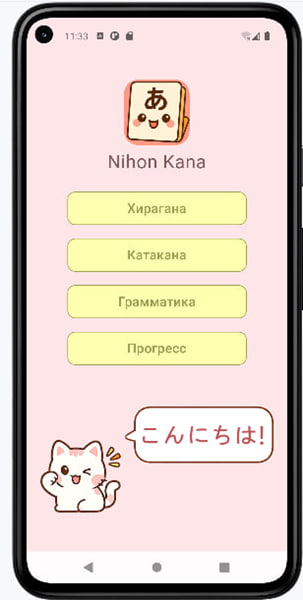 | 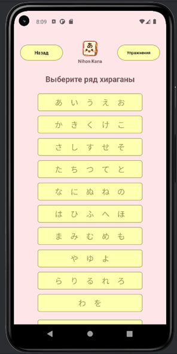 | 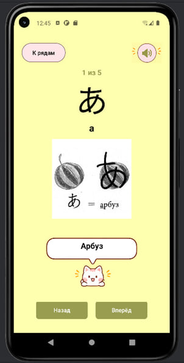 |

### Упражнения

| Выбор упражнений | Выбор типа упражнения | Индивидуальная тренировка |
|---|---|---|
| 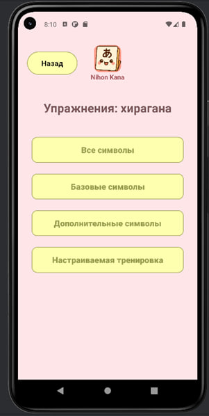 | 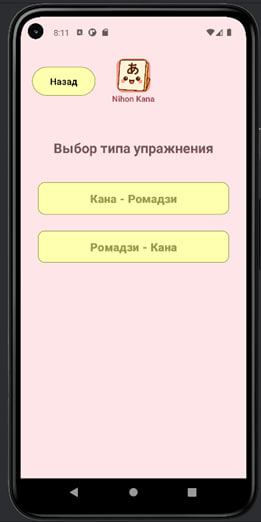 | 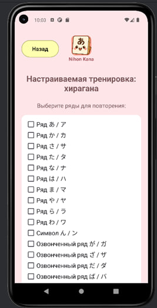 |

| Выполнение упражнения | Результат упражнения |
|---|---|
| 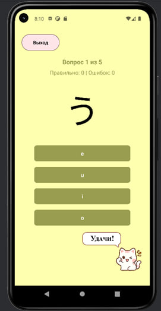 |  |

### Прогресс пользователя

| Общий прогресс | Прогресс по рядам |
|---|---|
| 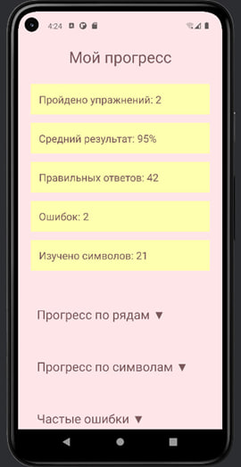 | 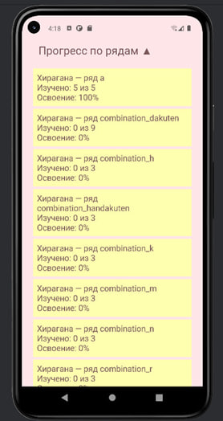 |

| Прогресс по символам | Частые ошибки |
|---|---|
| 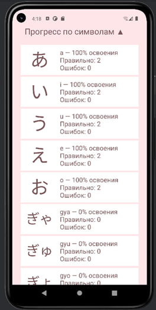 | 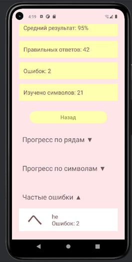 |

## Запуск проекта

Клонировать репозиторий:

```bash
git clone https://github.com/Akrobatochka/NihonKana_Android.git
```

После этого:

1. открыть проект в **Android Studio**;
2. дождаться завершения Gradle Sync;
3. выбрать Android-эмулятор или физическое устройство;
4. запустить приложение.

Для работы приложения не требуются API-ключи или настройка внешнего сервера.

Все основные данные хранятся локально с использованием Room / SQLite.

## Выпускная квалификационная работа

NihonKana был разработан в качестве выпускной квалификационной работы.

В рамках проекта были выполнены:

- анализ существующих мобильных приложений;
- проектирование структуры Android-приложения;
- проектирование реляционной базы данных;
- разработка пользовательского интерфейса;
- реализация обучающих карточек;
- реализация системы упражнений;
- работа с локальной базой данных;
- сохранение и анализ результатов пользователя;
- реализация системы отслеживания прогресса;
- пользовательское тестирование разработанного приложения.

## Планы развития

- [ ] интеграция с REST API;
- [ ] Retrofit;
- [ ] перенос логики экранов в `ViewModel`;
- [ ] добавление Repository layer;
- [ ] использование `StateFlow` для состояния UI;
- [ ] дальнейший рефакторинг архитектуры MVVM;
- [ ] Dependency Injection;
- [ ] Unit-тесты;
- [ ] UI-тесты;
- [ ] улучшение навигации;
- [ ] дальнейшая доработка пользовательского интерфейса.

## Автор

**Екатерина Ткачева**

Начинающий Android-разработчик